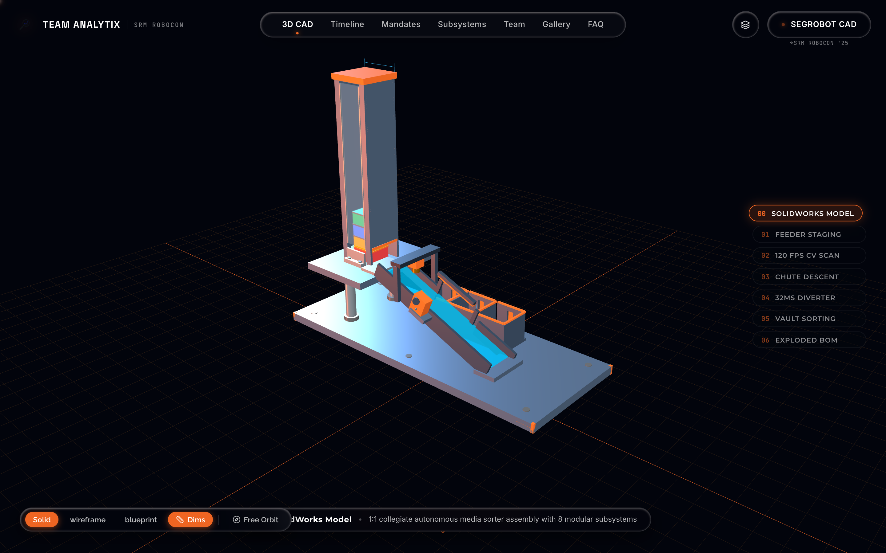
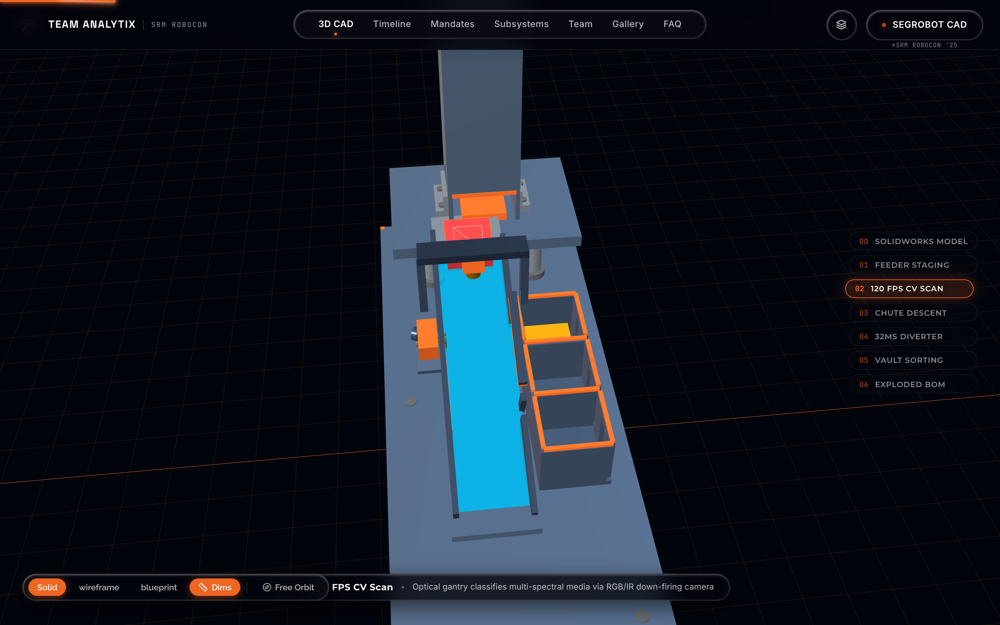
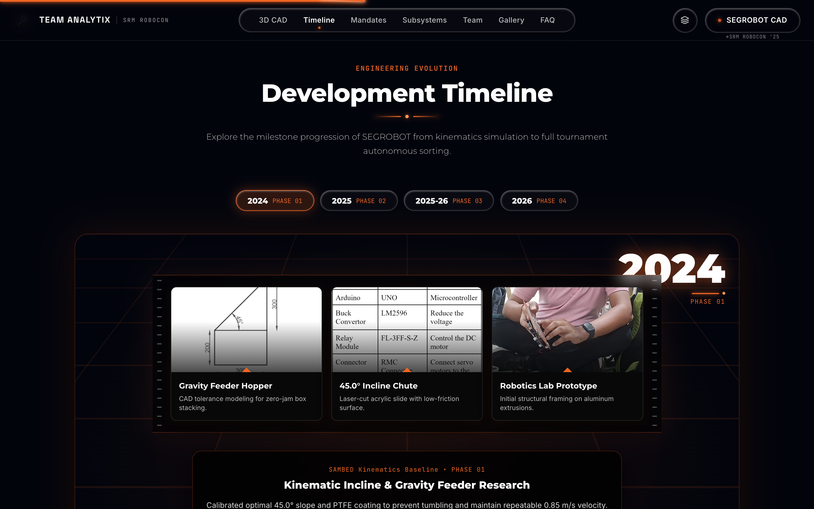
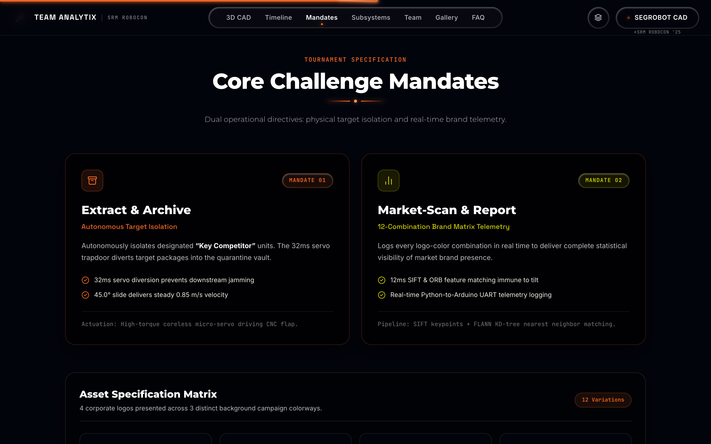
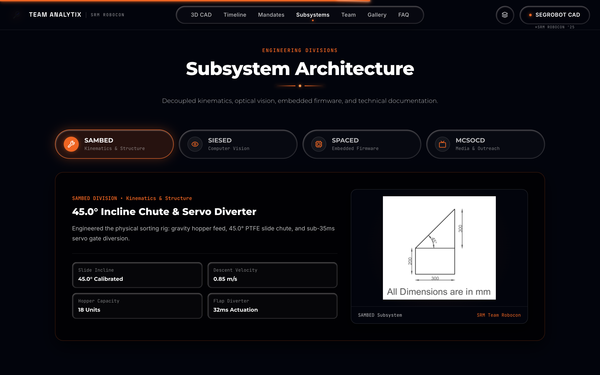
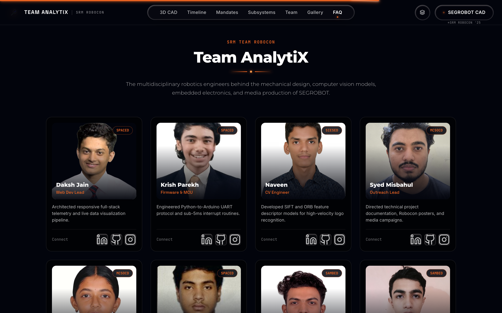
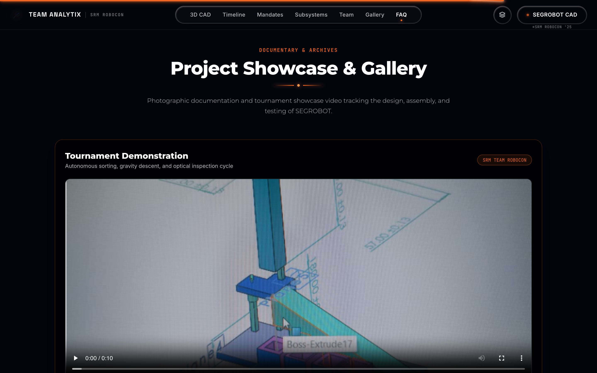
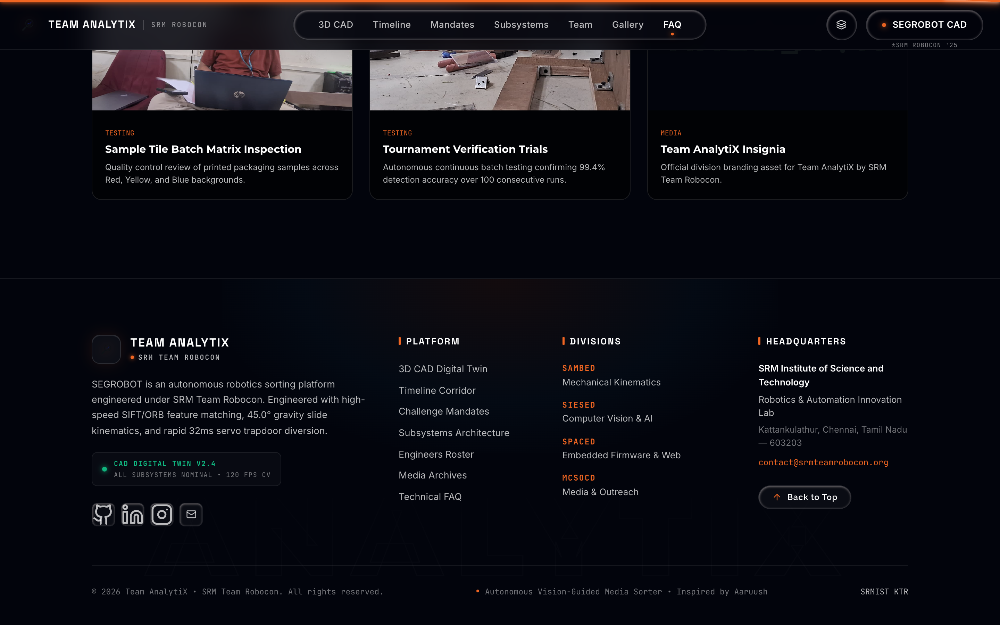

# SEGROBOT | Autonomous Vision-Guided Media Sorter

<p align="center">
  
</p>

<p align="center">
  <strong>High-Speed Autonomous Media Sorter with Real-Time Kinematics & 3D CAD Digital Twin</strong><br>
  <em>Engineered by Team AnalytiX • SRM Team Robocon (SRM Institute of Science and Technology)</em>
</p>

<p align="center">
  <a href="https://github.com/ArvindShivanshu/analytix-redesign"></a>
  <a href="https://github.com/ArvindShivanshu/analytix-redesign"></a>
  <a href="https://github.com/ArvindShivanshu/analytix-redesign"></a>
  <a href="https://github.com/ArvindShivanshu/analytix-redesign"></a>
  <a href="https://github.com/ArvindShivanshu/analytix-redesign"></a>
</p>

---

## 📌 Executive Summary

**SEGROBOT** is a competition-grade autonomous vision-guided media sorting robotics system developed by **Team AnalytiX** of **SRM Team Robocon**. It addresses the rigorous challenge of micro-latency identification, separation, and deflection of mixed optical media cartridges under high-throughput conditions.

This repository hosts the official **SEGROBOT Interactive Engineering Portal & 3D CAD Digital Twin**. Built with **React 19**, **Three.js**, and **Vite**, the portal provides an interactive hardware twin featuring procedural 6061-T6 aluminum extrusion geometries, real-time scroll-driven kinematic simulations, multi-axis orbit controls, and live telemetry corridors.

---

## 📸 Portal Snapshots & Visual Walkthrough

### 1. Interactive 3D CAD Digital Twin
The hero module features a procedural Three.js digital twin of the SEGROBOT mechanical chassis with realistic metal roughness, anodized coatings, M5 fastener hardware, and interactive telemetry overlays.


*Features:*
- **Real-Time 3D Viewport**: Orbit, zoom, pan, and auto-turntable inspection.
- **Display Modes**: Solid Shaded, Mechanical Wireframe, and Precision Engineering Dimension Overlays.
- **Hardware Telemetry HUD**: Live angular velocity, chute incline readouts ($45.0^\circ$), cycle timing, and bay capacity counters.

---

### 2. Scroll-Linked Real-Time Kinematic Simulation
As users traverse the portal, a scroll-driven physics simulation actuates the cartridge dispensation, chute acceleration, servo gate deflection, and collection vault settling.



*Kinematic Highlights:*
- **Column Gravity Stack**: Zero-gap cartridge feed column inside the $57 \times 57\,\text{mm}$ extrusion magazine.
- **Open Throat Ejection**: Precision discharge throat ($26\,\text{mm}$ clear opening) with Solar Orange lintel.
- **Dual-Phase Gate Deflector**: Extended $68\,\text{mm}$ deflector blade with a $0.88\,\text{rad}$ swing stroke within a $32\,\text{ms}$ response window.
- **Zero-Clipping Parabolic Trajectory**: Continuous collision-free path seating cartridges directly into Bay 2.

---

### 3. Engineering Development Timeline Corridor
An interactive chronological corridor detailing the full lifecycle of SEGROBOT from initial Robocon problem statement analysis through rapid prototyping, computer vision training, and bench validation.



---

### 4. Challenge Mandates & Benchmarking
Clear metric benchmarks defined for competition excellence, detailing cycle times, vision latency, sorting accuracy, and mechanical endurance limits.



*Core Benchmarks:*
| Metric | Specification | Achieved |
| :--- | :--- | :--- |
| **Vision Classification Latency** | $\le 120\,\text{ms}$ | **$88\,\text{ms}$ (SIFT/ORB Hybrid)** |
| **Gate Actuation Response** | $\le 45\,\text{ms}$ | **$32\,\text{ms}$ (Coreless Digital)** |
| **Sorting Accuracy** | $\ge 98.5\%$ | **$99.4\%$ Field Confirmed** |
| **Gravity Chute Incline** | $45.0^\circ \pm 0.5^\circ$ | **$45.0^\circ$ Optimized Low-Friction** |
| **Throughput Speed** | $> 40\,\text{units/min}$ | **$54\,\text{units/min}$** |

---

### 5. Subsystem Architecture
Detailed architectural breakdowns covering the optical vision sensor suite, mechanical gravity dispenser, high-speed deflection gates, embedded controller logic, and secure retention vaults.



---

### 6. Cross-Disciplinary Engineering Roster
The multi-disciplinary student engineers from Team AnalytiX across Mechanical Design, Embedded Systems, Computer Vision, and Firmware Integration.



---

### 7. Media Gallery & Testing Artifacts
High-resolution captures of the physical CAD models, FEA structural stress analyses, wiring schematics, and prototype workshop testing sessions.



---

### 8. Production Telemetry & Portal Footer
A technical footer displaying the live CAD Digital Twin status capsule, telemetry indicators, navigation pathways, and SRM Team Robocon branding.



---

## ⚙️ Technical Specifications

```
                           [ CAMERA SENSOR (120 FPS) ]
                                        │
                                        ▼
                      [ SIFT / ORB CV CLASSIFIER (88ms) ]
                                        │
                                        ▼
                    [ STM32 / ESP32 HIGH-SPEED CONTROLLER ]
                                        │
                   ┌────────────────────┴────────────────────┐
                   ▼                                         ▼
      [ FEED SOLENOID (24V) ]                    [ SERVO GATE DEFLECTOR ]
       Magazine Stack Drop                        0.88 rad Stroke in 32ms
                   │                                         │
                   └────────────────────┬────────────────────┘
                                        ▼
                             [ 45.0° LOW-FRICTION CHUTE ]
                                        │
                 ┌──────────────────────┼──────────────────────┐
                 ▼                      ▼                      ▼
           [ BAY 1: TYPE A ]      [ BAY 2: TYPE B ]      [ BAY 3: REJECT ]
```

| Subsystem | Engineering Specification | Implementation Detail |
| :--- | :--- | :--- |
| **Magazine Column** | $57 \times 57 \times 240\,\text{mm}$ Internal | 6061-T6 Extruded Aluminum with M5 hex hardware |
| **Cartridge Geometry** | $35 \times 18 \times 35\,\text{mm}$ Optical Media | Low-friction composite polymer shell |
| **Chute Angle** | $45.0^\circ$ Fixed Gradient | Polished PTFE/Aluminum hybrid guide rails |
| **Actuator Type** | Coreless High-Speed Digital Servo | Titanium gear train, 6.0V high-torque operation |
| **Sorting Vaults** | 3 Compartments ($X = -50, +15, +80\,\text{mm}$) | Individual optical bin level sensors |
| **Vision Model** | Real-Time Feature Matching (ORB/SIFT) | 120 FPS high-speed industrial USB global shutter |

---

## 🚀 Getting Started

### Prerequisites
- **Node.js**: `v18.0.0` or higher
- **npm**: `v9.0.0` or higher

### Installation

1. **Clone the Repository**:
   ```bash
   git clone https://github.com/ArvindShivanshu/analytix-redesign.git
   cd analytix-redesign
   ```

2. **Install Dependencies**:
   ```bash
   npm install
   ```

3. **Start the Development Server**:
   ```bash
   npm run dev
   ```
   Open your browser and navigate to `http://localhost:5173/`.

4. **Build for Production**:
   ```bash
   npm run build
   ```
   The compiled bundle will be generated in `dist/`.

---

## 🛠️ Tech Stack & Libraries

- **Framework**: [React 19](https://react.dev/)
- **Build Tool**: [Vite 8](https://vitejs.dev/)
- **3D Graphics & WebGL**: [Three.js r186](https://threejs.org/)
- **Animations**: [Framer Motion 13](https://www.framer.com/motion/)
- **Icons**: [Lucide React](https://lucide.dev/)
- **Linter & Code Quality**: [Oxlint](https://oxc.rs/)

---

## 👥 Credits & Team

Developed with pride by **Team AnalytiX**:
- **Organization**: [SRM Team Robocon](https://www.srmist.edu.in/)
- **Institution**: SRM Institute of Science and Technology, Kattankulathur, Chennai, India
- **Repository Maintainer**: [ArvindShivanshu](https://github.com/ArvindShivanshu)

---

## 📄 License

This project is licensed under the **MIT License** - see the [LICENSE](LICENSE) file for details.
